# Design Document: Thesis Merge

## Overview

This design describes the chapter-by-chapter strategy for merging two MTech thesis reports into a single unified document. The **Current Report** (Phase 3, SA-AKI mortality prediction) serves as the base template, and the **Old Report** (Phase 1/2, ICD-10-CM code prediction) content is woven into each chapter as additional sections. All modifications happen in the `tex files/IIT_Madras_MTech_in_Industrial_AI_Thesis_Template/` directory.

The merge follows a "Problem 1 / Problem 2" framing under a unified clinical decision support theme, with MIMIC-IV as the common data foundation. Problem 1 (ICD coding) is presented as partially completed due to infrastructure costs; Problem 2 (SA-AKI) is fully completed with results. The cardinal rule is **zero information loss** from the Current Report.

## Architecture

The merge is a document restructuring operation, not a software system. The architecture is the chapter structure of the unified thesis:

```mermaid
graph TD
    A[thesis.tex — Unified title & metadata] --> B[Chapter 1: Introduction]
    A --> C[Chapter 2: Literature Review]
    A --> D[Chapter 3: Problem Definition]
    A --> E[Chapter 4: Methodology]
    A --> F[Chapter 5: Dataset Understanding & EDA]
    A --> G[Chapter 6: Results]
    A --> H[Chapter 7: Conclusions & Future Work]
    A --> I[references.bib — Merged bibliography]
    
    B --> B1[Clinical Decision Support framing]
    B --> B2[Problem 1: ICD Coding — from Old Report]
    B --> B3[Problem 2: SA-AKI — preserved from Current Report]
    
    C --> C1[Part I: ICD Coding Literature — from Old Report]
    C --> C2[Part II: SA-AKI Literature — preserved from Current Report]
    C --> C3[Synthesis section]
    
    D --> D1[Problem 1: ICD Multi-label Classification — from Old Report]
    D --> D2[Problem 2: SA-AKI Mortality — preserved from Current Report]
    
    E --> E1[Problem 1 Methodology — from Old Report, marked proposed]
    E --> E2[Problem 2 Methodology — preserved from Current Report]
    
    F --> F1[MIMIC-IV for ICD Coding — from Old Report]
    F --> F2[SA-AKI Cohort EDA — preserved from Current Report]
    
    G --> G1[Problem 1 Partial Results — from Old Report]
    G --> G2[Problem 2 Full Results — preserved from Current Report]
    
    H --> H1[Problem 1 Summary & Future Work]
    H --> H2[Problem 2 Summary & Future Work — preserved from Current Report]
```



### Merge Principle

For every chapter file, the merge follows this pattern:
1. **Preserve** the entire Current Report chapter content verbatim (all sections, paragraphs, equations, figures, tables, citations).
2. **Prepend or insert** Old Report content as clearly labeled new sections (e.g., `\section{Problem 1: ...}`).
3. **Add** transitional text and a unified chapter opening where needed.
4. **Update** `\label{}` tags from the Old Report to avoid conflicts (prefix with `old:` or use distinct names).

## Components and Interfaces

Each component below is a file that will be modified. The "interface" is the LaTeX section structure within each file.

### 1. `thesis.tex` — Main File

**Changes:**
- Update `\dissertationTitle` to a unified title referencing both clinical decision support themes and MIMIC-IV (e.g., "Machine Learning for Clinical Decision Support: Automated ICD Code Prediction and Early Mortality Risk Stratification in the MIMIC-IV Dataset").
- Update `\dissertationYear` to `2026`, `\dissertationMonth` to the appropriate submission month, `\dissertationCertificateDate` to `2026`.
- Add `\usepackage{pgfgantt}` and `\usepackage{float}` if not already present (needed for Old Report Gantt chart content).
- Retain all other metadata (author, department, degree, guides).

### 2. `chap-1-introduction.tex` — Unified Introduction

**Target section structure:**
```
\chapter{Introduction}
  \section{Clinical Decision Support and the MIMIC-IV Foundation}  ← NEW unified opener
  \section{Problem 1: Automated ICD Code Prediction for Rare Diseases}  ← FROM Old Report
    (summarized ICD coding motivation, challenges, proposed approach)
    (note: partially completed due to infrastructure costs)
  \section{Clinical background and motivation}  ← PRESERVED from Current Report
  \section{What the literature has tried and where it falls short}  ← PRESERVED
  \section{Problem focus and research objectives}  ← PRESERVED
  \section{Proposed approach and evaluation plan}  ← PRESERVED
  \section{Chapter roadmap}  ← UPDATED to describe merged thesis structure
```

### 3. `chap-2-literature-review.tex` — Unified Literature Review

**Target section structure:**
```
\chapter{Literature Review}
  \section{Part I: Automated ICD Coding}  ← FROM Old Report
    \subsection{Introduction and the Evolution of ICD Coding}
    \subsection{Early Approaches to Automated ICD Coding}
    \subsection{Deep Learning for Automated ICD Coding}
    \subsection{Transformer-Based Architectures and Extensions}
    \subsection{Curriculum Learning and Hierarchical Knowledge Integration}
    \subsection{Challenges in Automated ICD Coding}
    \subsection{Synthetic Data Generation for Rare ICD-10-CM Codes}
    \subsection{Benchmarks and Evaluation Metrics}
    \subsection{Summary of ICD Coding Literature}
  \section{Part II: SA-AKI Mortality Prediction}  ← PRESERVED from Current Report
    (all existing sections preserved verbatim)
  \section{Synthesis: Machine Learning for Clinical Decision Support Using MIMIC-IV}  ← NEW
```

### 4. `chap-3-problem-definition.tex` — Unified Problem Definition

**Target section structure:**
```
\chapter{Problem Definition and Formulation}
  \section{Problem 1: Automated ICD-10-CM Code Prediction}  ← FROM Old Report
    \subsection{Scope of the Problem}
    \subsection{Central Challenges}
    \subsection{Mathematical Formulation of the Task}
    \subsection{Significance of Rare Codes}
    \subsection{Proposed Methodological Focus}
    \subsection{Evaluation Framework}
    (note at end: methodology proposed but not fully executed)
  \section{Problem 2: SA-AKI Early Mortality Risk Stratification}  ← PRESERVED
    (all existing sections from Current Report preserved verbatim:
     Clinical decision and scope, Observational unit, Data-generating view,
     Problem 1/2/3 (renumbered as Sub-problems), Evaluation protocol,
     Assumptions and risks, Compact statement of aims)
```

Note: The Current Report's internal "Problem 1/2/3" (phenotyping, classification, survival) will be relabeled as "Sub-problem A/B/C" or kept with a clarifying note to avoid confusion with the thesis-level Problem 1/Problem 2 framing.

### 5. `chap-4-methodology.tex` — Unified Methodology

**Target section structure:**
```
\chapter{Methodology}
  \section{Problem 1: ICD Code Prediction Methodology (Proposed)}  ← FROM Old Report
    \subsection{Ontology-Based Disease Grouping}
    \subsection{Synthetic Discharge Summary Generation}
    \subsection{Deep Learning Model Training and Testing}
    \subsection{Evaluation Metrics and Analysis}
    \subsection{Processing MIMIC-IV as the Test Dataset}
    (clearly marked as proposed but not fully executed)
  \section{Problem 2: SA-AKI Mortality Prediction Methodology}  ← PRESERVED
    (all existing sections from Current Report preserved verbatim:
     Overview, Data Sources/ETL/Cohort, Data Split and Leakage Control,
     Preprocessing and Feature Engineering, EDA and Phenotyping,
     Supervised Binary Mortality Prediction, Survival Analysis,
     Adherence to TRIPOD Guidelines including Data Leakage subsection
     and 24-Hour Window subsection)
```

### 6. `chap-5-dataset-understanding.tex` — Unified Dataset Understanding

**Target section structure:**
```
\chapter{Dataset Understanding and EDA}
  \section{Part I: MIMIC-IV for ICD Coding (Problem 1)}  ← FROM Old Report
    \subsection{Overview of MIMIC-IV}
    \subsection{SQL Query Results and Data Highlights}
    \subsection{Visual Explorations of MIMIC-IV}  (all 10 plots)
    \subsection{Key Insights}
    \subsection{Final Data Preparation}
  \section{Part II: SA-AKI Cohort (Problem 2)}  ← PRESERVED from Current Report
    (all existing sections preserved verbatim:
     Overview, Source Tables, Ontology-Driven Concept Identification,
     Cohort Construction, Clinical Labeling Rules, Timeline Conventions,
     Data Harmonization, Exploratory Analysis and Phenotyping)
```

### 7. `chap-6-results.tex` — Unified Results

**Target section structure:**
```
\chapter{Results}
  \section{Problem 1: ICD Coding Partial Results}  ← FROM Old Report
    \subsection{Baseline Model: KNN}
    \subsection{MinHash-Based Similarity Detection}
    \subsection{Key Observations and Challenges}
    \subsection{Rare Disease Co-Occurrence Pipeline}
    (note: full model training and synthetic data generation not completed)
  \section{Problem 2: SA-AKI Mortality Prediction Results}  ← PRESERVED
    (all existing sections preserved verbatim:
     Supervised Mortality Prediction with all subsections,
     Time-to-Event Survival Analysis with all subsections)
```

### 8. `chap-7-conclusions.tex` — Unified Conclusions

**Target section structure:**
```
\chapter{Conclusions and Future Work}
  \section{Summary of Problem 1: ICD Code Prediction}  ← NEW, summarizing Old Report work
    (literature review, problem formulation, dataset understanding, preliminary results completed;
     synthetic data generation and full model training not executed due to infrastructure costs)
  \section{Summary of Problem 2: SA-AKI Mortality Prediction}  ← PRESERVED from Current Report
    (all four key contributions preserved verbatim)
  \section{Future Work}  ← MERGED
    \subsection{Problem 1: Remaining Steps}
      (completing synthetic data generation, model training when infrastructure available)
    \subsection{Problem 2: Future Directions}
      (all existing future work items preserved verbatim:
       External Validation, Monte Carlo Simulation, Multi-Database Risk Framing,
       Temporal Windows, Model Fairness, Prospective Clinical Impact Study)
```

### 9. `references.bib` — Merged Bibliography

**Strategy:**
- Append all entries from `Old_project_feb_2025_thesis_folder/thesis/references/references.bib` to the current `references.bib`.
- Deduplicate entries that appear in both files (e.g., `johnson2023mimicivscidata` vs `Johnson_2023_MIMIC` — keep the Current Report's citation key and add an alias or redirect for the Old Report's key).
- The Old Report uses different citation keys (e.g., `johnson2023mimicivscidata`) while the Current Report uses keys like `Johnson_2023_MIMIC`. Both must be present so that citations from both reports resolve correctly.

### 10. Image Files

**Action:** Copy all files from `Old_project_feb_2025_thesis_folder/thesis/mimic_plots/` to a new directory `tex files/IIT_Madras_MTech_in_Industrial_AI_Thesis_Template/mimic_plots/`. Update figure paths in the Old Report content to reference `mimic_plots/` (relative to the thesis root).

## Data Models

Not applicable — this is a document restructuring project, not a software system. The "data" is LaTeX content, and the "model" is the chapter/section hierarchy described above.

### Label Conflict Resolution

The Old Report and Current Report both define `\label{chap:...}` for their chapters. To avoid LaTeX compilation errors:

| Old Report Label | Merged Label | Notes |
|---|---|---|
| `chap:introduction` | Remove (content folded into `chap:intro`) | Old intro content becomes sections within Chapter 1 |
| `chap:literaturereview` | Remove (content folded into `chap:litreview`) | Old lit review becomes Part I |
| `chap:problemdefinition` | Remove (content folded into `chap:problem`) | Old problem def becomes Problem 1 section |
| `chap:methodology` | Remove (content folded into `chap:methods`) | Old methodology becomes Problem 1 section |
| `chap:dataset_understanding` | Remove (content folded into `chap:eda`) | Old dataset becomes Part I |
| `chap:results` | Already same label — no conflict | Old results become Problem 1 section |
| `chap:conclusion` | Already same label — no conflict | Old conclusion summarized in new section |

Section-level labels from the Old Report (e.g., `sec:mathformulation`, `sec:rare_codes`, `sec:processing_mimic_iv`, `sec:final_data_preparation`) will be prefixed with `p1:` to avoid conflicts (e.g., `sec:p1:mathformulation`).


## Correctness Properties

*A property is a characteristic or behavior that should hold true across all valid executions of a system — essentially, a formal statement about what the system should do. Properties serve as the bridge between human-readable specifications and machine-verifiable correctness guarantees.*

### Property 1: Current Report Content Preservation

*For any* chapter file in the Current Report, every `\section`, `\subsection`, `\begin{equation}`, `\begin{table}`, `\begin{figure}`, `\label{}`, and `\caption{}` block present in the original file must also appear (verbatim or with only whitespace changes) in the corresponding merged chapter file. The merged file must be a strict superset of the original Current Report content.

**Validates: Requirements 2.3, 3.2, 4.2, 5.2, 5.3, 6.2, 6.3, 7.2, 7.3, 8.2, 13.1, 13.2**

### Property 2: Citation Key Completeness

*For any* `\citep{}` or `\cite{}` key appearing in any original chapter file from either the Old Report or the Current Report, that citation key must be present as a `@...{key,` entry in the merged `references.bib` file.

**Validates: Requirements 2.6, 3.4**

### Property 3: Label Uniqueness

*For any* `\label{...}` definition across all merged chapter files, no two labels shall have the same identifier. Every label string must be unique across the entire set of `.tex` files included by `thesis.tex`.

**Validates: Requirements 14.2**

### Property 4: Figure Path Validity

*For any* `\includegraphics{...}` path referenced in any merged chapter file, the referenced file must exist at the specified path relative to the `tex files/IIT_Madras_MTech_in_Industrial_AI_Thesis_Template/` directory.

**Validates: Requirements 14.4**

## Error Handling

Since this is a LaTeX document restructuring project rather than a software system, "error handling" translates to handling merge conflicts and compilation issues:

1. **Duplicate Labels:** If the Old Report and Current Report define the same `\label{}`, the Old Report label is renamed with a `p1:` prefix. All corresponding `\ref{}` commands in Old Report content are updated accordingly.

2. **Duplicate Citation Keys:** If both `.bib` files define the same citation key with different content, the Current Report's entry takes precedence. The Old Report's entry is either removed (if identical) or renamed with a suffix (e.g., `_old`), and Old Report `\cite{}` commands are updated.

3. **Missing Packages:** If Old Report content uses LaTeX packages not declared in the Current Report's `thesis.tex`, those `\usepackage{}` declarations are added. Known additions: `pgfgantt`, `float`.

4. **Figure Path Mismatches:** Old Report figures reference `mimic_plots/plotN.jpg`. These images must be copied to the Current Report's directory structure, and paths in the merged content must be updated to match.

5. **Section Numbering Conflicts:** The Current Report's Problem Definition chapter internally uses "Problem 1", "Problem 2", "Problem 3" for phenotyping, classification, and survival sub-problems. In the merged thesis, these are clarified with a note or relabeled to avoid confusion with the thesis-level Problem 1 (ICD) / Problem 2 (SA-AKI) framing.

## Testing Strategy

### Manual Verification (Primary)

Since this is a LaTeX document project, the primary testing approach is manual:

1. **Compilation Test:** Run `latexmk` or `pdflatex` + `bibtex` on the merged thesis and verify zero errors/warnings.
2. **Visual Inspection:** Review the generated PDF to confirm all sections, figures, tables, and equations render correctly.
3. **Content Diff:** For each chapter, diff the merged file against the original Current Report file to confirm no Current Report content was removed.

### Automated Checks (Supplementary)

Simple scripts can verify the correctness properties:

1. **Content Preservation Check (Property 1):** A script that extracts all `\section{}`, `\subsection{}`, `\begin{equation}`, `\begin{table}`, `\begin{figure}`, and `\label{}` lines from each original Current Report chapter file and verifies each one appears in the corresponding merged file.

2. **Citation Key Check (Property 2):** A script that extracts all `\citep{}` and `\cite{}` keys from all merged `.tex` files and verifies each key exists in the merged `references.bib`.

3. **Label Uniqueness Check (Property 3):** A script that extracts all `\label{...}` definitions from all `.tex` files and checks for duplicates.

4. **Figure Path Check (Property 4):** A script that extracts all `\includegraphics{...}` paths from all `.tex` files and verifies the referenced files exist on disk.

These checks should be run after each chapter merge task is completed. Property-based testing libraries are not applicable here since this is a document restructuring project, but the automated checks above serve the same purpose of verifying universal properties across all content.
